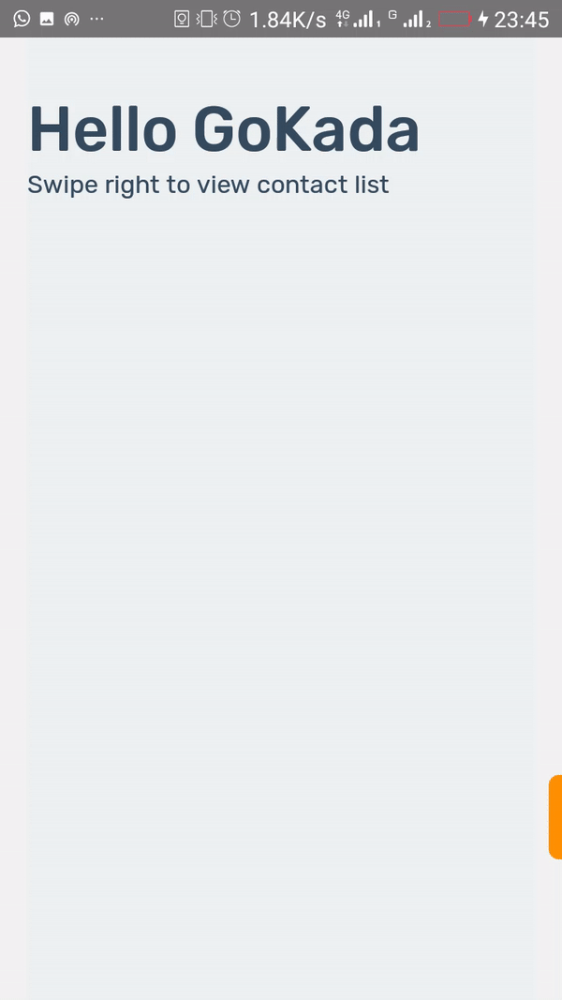

# gokada 

## Preview

<span>
 
</span>


## Getting Started

1. Fork or Clone the repo, then set it up:

```
$ cd gokada
$ yarn install
```

### Run on Android

```
$ npx react-native run-android
```

### Run on iOS

```
$ cd ios && pod install
$ cd .. && npx react-native run-ios
```
